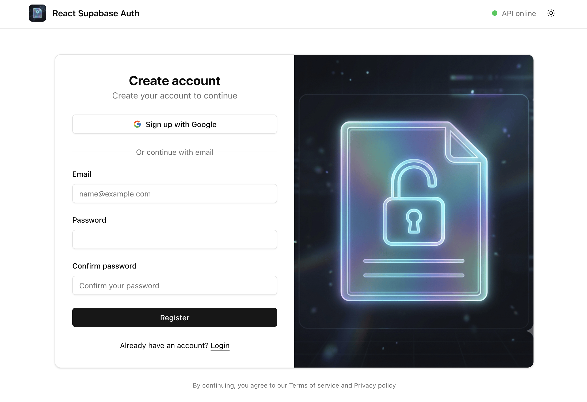

<div>
<h3>React + Supabase Auth</h3>
<p>
Minimal <strong>React + Vite + Supabase Auth</strong> starter from <a href="https://github.com/open-templates">@open-templates</a> — Google OAuth, email/password flows, protected routes, and JWT calls to a paired Cloudflare Worker API.
</p>
<a href="https://github.com/open-templates/react-supabase-auth-template/generate"></a>
</div>

<br/><br/>

<div align="center">

[](https://github.com/open-templates/react-supabase-auth-template/releases)
[](https://github.com/open-templates/react-supabase-auth-template/blob/main/LICENSE)
[](https://github.com/open-templates/react-supabase-auth-template)
[](https://github.com/open-templates/react-supabase-auth-template/actions/workflows/ci.yml)

<br/>
<br/>

<br/>

</div>

<hr>

## Features

- **Google OAuth** — `signInWithOAuth({ provider: 'google' })` via Supabase
- **Email auth** — login, signup, password recovery, and reset
- **Auth routing** — guest-only and authenticated route guards
- **Session handling** — `AuthContext` with access token mirrored for API calls
- **API health indicator** — header polls `GET /health` every 30s
- **Protected home** — `GET /me` with the Supabase JWT on the authenticated landing page
- **Backend pairing** — shared contract with [cf-hono-supabase-api-template](https://github.com/open-templates/cf-hono-supabase-api-template)
- **Init wizard** — `./scripts/init-from-template.sh` personalizes repo metadata from `templates/`

## Stack

- React 19, TypeScript, Vite 7
- Supabase Auth (`@supabase/supabase-js`)
- Tailwind CSS, shadcn-style UI primitives
- Bun (package manager)

## Quick start

1. **Use this template** on GitHub, then clone your repo.
2. Personalize from `templates/`:

```bash
./scripts/init-from-template.sh
```

3. Install and run:

```bash
bun install
cp .env.example .env.local
bun run dev
```

Start the API worker first ([cf-hono-supabase-api-template](https://github.com/open-templates/cf-hono-supabase-api-template) on port `8787`) so health and `/me` work locally.

See [`templates/ABOUT_TEMPLATES.md`](templates/ABOUT_TEMPLATES.md) and [`docs/INIT_TEMPLATE.md`](docs/INIT_TEMPLATE.md).

## Environment variables

| Variable | Required | Purpose |
|----------|----------|---------|
| `VITE_SUPABASE_URL` | Yes | Supabase project URL |
| `VITE_SUPABASE_PUBLISHABLE_KEY` | Yes | Supabase anon/publishable key |
| `VITE_API_BASE_URL` | No | Worker URL (default `http://localhost:8787`) |

Supabase + Google OAuth setup: [`docs/SUPABASE_SETUP.md`](docs/SUPABASE_SETUP.md)

## Scripts

| Script | Purpose |
|--------|---------|
| `bun run dev` | Development server |
| `bun run build` / `bun run ci` | Production build |
| `bun run lint` / `bun run typecheck` | Quality checks |
| `bun run init` | Copy `templates/` → root (after fork) |

## Deployment

Target: **Cloudflare Pages**. Build command `bun run build`, output directory `dist`. Set the same `VITE_*` variables in the Pages project settings.

## Documentation

| Doc | Description |
|-----|-------------|
| [`index.md`](index.md) | OKF bundle — routes, API contracts, extension notes |
| [`INSTRUCTIONS.md`](INSTRUCTIONS.md) | Maintainer and adopter guide |
| [`docs/SUPABASE_SETUP.md`](docs/SUPABASE_SETUP.md) | Supabase project + Google OAuth |
| [`docs/INIT_TEMPLATE.md`](docs/INIT_TEMPLATE.md) | Init wizard reference |
| [`.agents/skills/`](.agents/skills/) | Cursor agent skills catalog |
| [`CHANGELOG.md`](CHANGELOG.md) | Release history |

**Supabase Auth pack:** pairs with [cf-hono-supabase-api-template](https://github.com/open-templates/cf-hono-supabase-api-template) (Hono), or any backend implementing the same `GET /health` and JWT `GET /me` contract.

Maintained by [@open-templates](https://github.com/open-templates) · [Charlie Rios (@xarlizard)](https://github.com/xarlizard)

## License

MIT — see [LICENSE](LICENSE).

---

## Repository documents

**README** | [INSTRUCTIONS](INSTRUCTIONS.md) | [CHANGELOG](CHANGELOG.md) | [CONTRIBUTING](CONTRIBUTING.md) | [SECURITY](SECURITY.md) | [CODE_OF_CONDUCT](CODE_OF_CONDUCT.md)
